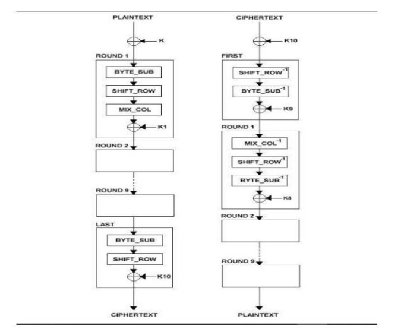

École nationale superieur polytechnique

de Yaounde

Expose

AES EN LANGAGE C

Etudiants :

MBASSI LOIC (21P340 )

NGOUPAYE THIERRY (21P086) Encadreur : VUIDE JORDAN (21P018) Dr Hervé TALE KALACHI WANDJI EMMANUEL (21P030)

WOTCHOKO YOHAN (21P228)

21 novembre 2023

TABLE DES MATIÈRES Table des matières![ref1]

Table des matières

1 Introduction 2

2 Historique et évolution 3

3 Principe de fonctionnement 4

1. Chiffrement symétrique . . . . . . . . . . . . . . . . . . . . . . . . . . . . . 4
1. Étapes de chiffrement à partir de la clé . . . . . . . . . . . . . . . . . . . . 4
1. Substitution de bits (byte substitution : Fonction BYTE\_SUB) . . 4
1. Décalage sur les lignes(Fonction SHIFTROW) . . . . . . . . . . . . 5
1. Mixage de colonne (Fonction MIX\_COL) . . . . . . . . . . . . . . 6
1. XOR . . . . . . . . . . . . . . . . . . . . . . . . . . . . . . . . . . . 6
1. Génération de la clé . . . . . . . . . . . . . . . . . . . . . . . . . . 6
3. Déchiffrement . . . . . . . . . . . . . . . . . . . . . . . . . . . . . . . . . . 7

   3\.3.1 Principe de fonctionnement . . . . . . . . . . . . . . . . . . . . . . 9

4 forces et vulnérabIlIté 9 5 champs d’application de l’aes 10

6 ordinateurs quantiques 10

1. Définition . . . . . . . . . . . . . . . . . . . . . . . . . . . . . . . . . . . 10
1. Intérêt . . . . . . . . . . . . . . . . . . . . . . . . . . . . . . . . . . . . . . 10
1. Exercice 1 . . . . . . . . . . . . . . . . . . . . . . . . . . . . . . . . 11
1. Exercice 2 . . . . . . . . . . . . . . . . . . . . . . . . . . . . . . . . 11
1. Exercice 3 . . . . . . . . . . . . . . . . . . . . . . . . . . . . . . . . 12
1. Exercice 4 . . . . . . . . . . . . . . . . . . . . . . . . . . . . . . . . 12
1. Exercice 5 . . . . . . . . . . . . . . . . . . . . . . . . . . . . . . . . 12
1. solution 1 . . . . . . . . . . . . . . . . . . . . . . . . . . . . . . . . 13
1. solution 2 . . . . . . . . . . . . . . . . . . . . . . . . . . . . . . . . 13
1. solution 3 . . . . . . . . . . . . . . . . . . . . . . . . . . . . . . . . 14
1. solution 4 . . . . . . . . . . . . . . . . . . . . . . . . . . . . . . . . 16
1. solution 5 . . . . . . . . . . . . . . . . . . . . . . . . . . . . . . . . 17

7 Conclusion 18 8 Bibliographie 20

1 Introduction![ref1]

1  Introduction![ref2]

La Cryptographie tout comme le savoir, a commencé avec l’écriture. En 1998, le National Institute of Standards and Technology ( (NIST) des États-Unis d’Amérique a lancé un appel pour la mise en place d’un nouveau modèle de chiffrement, afin de remplacer le Data Encryption Standard, qui se faisait vieillissant et moins sûr. Pendant des mois, la communauté cryptographique mondiale a partagé ses expériences et son savoir à ce sujet. De cet effortrésulte le Advanced Encryption Standard, issu du projet belge nommé Rijndael. Qu’est-ce que l’AES et en quoi consiste-t-il? Pourquoi l’a-t-on, jusqu’à présent, adopté comme norme de chiffrement? C’est dans la quête de réponses à ces questions que notre devoir tient sa place aujourd’hui.

2 Historique et évolution![ref1]

2  Historique et évolution![ref2]

L’AES (Advanced Encryption Standard) est, comme son nom l’indique, un stan- dard de cryptage symétrique destiné à remplacer le DES (Data Encryption Standard) qui est devenu trop faible au regard des attaques actuelles. Il est issu d’un appel à candidatures international lancé en janvier 1997 et ayant reçu 15 pro- positions . Parmi ces 15 algorithmes, 5 furent choisis pour une évaluation plus pous- sée en avril 1999 : MARS, RC6, Rijndael, Serpent, et Twofish. Au bout de cette évaluation, ce fut finalement le candidat Rijndael, du nom de ses deux concepteurs Joan Daemen et Vincent Rijmen (tous les deux de nationalité belge) qui a été choisi . Ces deux experts en cryptographie étaient déjà les auteurs d’un autre algorithme : Square. AES est un sous-ensemble de Rijndael :

il ne travaille qu’avec des blocs de 128 bits alors que Rijndael offre des tailles de blocs et de clefs qui sont des multiples de 32 (compris entre 128 et 256 bits). Ce faisant, l’AES remplace le DES (choisi comme standard dans les années

\1970) qui de nos jours devenait obsolète, car il utilisait des clefs de 56 bits seulement\. L’AES a été adopté par le NIST (National Institute of Standards and Technology) en 2001\. De plus, son utilisation est très pratique car il consomme peu de mémoire et n’étant pas basé sur un schéma de Feistel, sa complexité est moindre et il est plus facile à mettre en œuvre\.

- C’est un algorithme de chiffrement par blocs (comme le DES)
- Il supporte différentes combinaisons [longueur de clé]-[longueur de bloc] : 128-128, 192-128 et 256-128 bits.

En termes décimaux, ces différentes tailles possibles signifient concrètement que :

- 3.4 x 1038 clés de 128-bit possibles
- 6.2 x 1057 clés de 192-bit possibles
- 1.1 x 1077 clés de 256-bit possibles

Pour avoir un ordre d’idée, les clés DES ont une longueur de 56 bits (64 bits au total dont 8 pour les contrôles de parité), ce qui signifiequ’il y a approximativement 7.2 x 1016 clés différentes possibles.![ref3]

Cela nous donne un ordre de 1021 fois plus de clés 128 bits pour l’AES que de

clés 56 bits pour le DES. En supposant que l’on puisse construire une machine qui pourrait cracker une clé DES en une seconde (donc qui puisse calculer 255 clés par seconde), alors cela prendrait encore 149 mille milliards d’années pour cracker une

clé AES. Pour donner un ordre d’idée plus concret, l’univers est vieux de 20 milliards d’années au maximum. Pour conclure sur cet aspect, on voit que le standard AES répond aux mêmes exigences que le DES mais il est également beaucoup plus

sûr et flexible que son prédécesseur.

3 Principe de fonctionnement![ref1]

3  Principe de fonctionnement
1. Chiffrement symétrique![ref4]

Le Chiffrement symétrique , encore dit, cryptographie symétrique ou encore à clé secrète (à contrario) cryptographie asymétrique), est la première forme de chiffrement imaginée dans les temps passés. Elle consiste à utiliser une même clé pour les opérations de chiffrement et de déchiffrement. L’exemple le plus typique est celui du chiffrement de César dont la clé est un le nombre de décalage sur les lettres de l’alphabet.![ref5]

L’AES est un chiffrement par bloc. Il nécessite de scinder le texte clair en sous-blocs qui seront chiffrés indépendamment à partir d’une clé de 128, 192 ou 256 bits par une séquence de 10, 12, 14 tours respectivement suivant la taille de la clé. Avant chaque répé- tition, on créera ce que l’on appelle la RoundKey, qui est une clé dérivée de la clé initiale.

Sur n tours, les n – 1 premiers suivent tous un cycle à 4 étapes. Une 1ère clé est donnée initialement; et pour chaque tour, une clé est générée à partie de la clé précédente.

Les étapes de ce cycle sont :

2. Étapes de chiffrement à partir de la clé
1. Substitution de bits (byte substitution : Fonction BYTE\_SUB)

Rapport - AES EN LANGAGE C 4
2. Étapes de chiffrement à partir de la clé 6 Principe de fonctionnement![ref1]

Opération de substitution non-linéaire opérant indépendamment sur chaque bloc à partir d’une table de correspondance (table de substitution : S\_BOX).

2. Décalage sur les lignes(Fonction SHIFTROW)

Opération qui considère n morceaux de 4 octets chacun et décale chaque morceau successivement de 1 à n – 1 octets.

3. Mixage de colonne (Fonction MIX\_COL)

C’est une Opération qui transforme chaque octet du bloc en une combi- naison linéaire d’octets de ces derniers et qui peut être exprimée mathématiquement par un produit matriciel sur le corps de Galois ( 28). La matrice utilisée pour la multiplication est la suivante :

4. XOR

La 4e étape continue en un XOR entre le bloc et la clé de même taille.

XOR

0 | 0 | 0 0 | 1 | 1 1 | 1 | 1

1 | 1 | 0![ref5]

5. Génération de la clé

On considère que nous sommes à la génération de la i-ième clé. La clé 0 est la clé initiale.

1. 1ère colonne (C1) de la clé i

Elle est obtenue en :

- Décalant les octets d’un seul de la 4 colonne de la clé I – 1 vers le haut.
- Procédant à une substitution de bits à partir de la table utilisée dans le chiffrement pour chaque tour.
- En exécutant un XOR successivement avec la 1ère colonne de la clé I – 1 et avec une colonne d’octets contenant le nombre I à partir du 1er octet.

Rapport - AES EN LANGAGE C 6
3. Déchiffrement 8 Principe de fonctionnement![ref1]

2. Autres colonnes Cj de la clé i![ref6]![ref7]
3. Déchiffrement

Rapport - AES EN LANGAGE C 8

4 forces et vulnérabIlIté![ref1]

3.3.1 Principe de fonctionnement

Le déchiffrement consiste à appliquer les opérations inverses, dans l’ordre inverse et avec des sous-clés également dans l’ordre inverse.

4  forces et vulnérabIlIté

L’AES à été adopté comme standard de chiffrement aujourd’hui grâce à de nombreuses caractéristiques![ref8] :

- Le simple design de l’algorithme de chiffrement qui offre une facilité dans la mise en œuvre sur différentes plateformes.
- La flexibilité du modèle de chiffrement qui permet une implémentation logicielle ou matérielle (architecture de câblage).

Rapport - AES EN LANGAGE C 10

6 ordinateurs quantiques![ref1]

- L’exécution rapide du chiffrement ce qui permet une portabilité facile sur des sys- tèmes en ressources limitées.
- La forte sécurité comparativement au DES en ce que la plus basse protection de l’AES (128 bits) nécessite un test sur près de 1038 clés possibles.
5  champs d’application de l’aes![ref9]
- Sécurité informatique : La sécurisation des transactions en ligne et la confiden- tialité des données dans les protocoles de sécurité informatique tels que le protocole SSL/TLS.
- Communication sécurisée : Le chiffrement des données transférées sur les réseaux dans les protocoles de communication sécurisée, tels que les VPN.
- Stockage des données : Le chiffrement des fichiers individuels, tels que des documents sensibles, des archives compressées, des bases de données, sur les disques durs, clés, etc... afin de les protéger contre l’accès non autorisé.
- Paiements électroniques : La protégeant des données financièresdes utilisateurs dans les protocoles de paiement électronique sécurisé pour chiffrer les informations de paiement lors des transactions en ligne.
- Sécurité des services cloud : Le chiffrement des données stockées et transmises dans le cloud.
6  ordinateurs quantiques
1. Définition
- Un ordinateur quantique, encore appelé, calculateur quantique ou pro- cesseur quantique est un système informatique qui utilise les propriétés quan- tiques de la matière qui se résument à la superposition des états des électrons, afin d’effectuer des opérations sur des données.
- Au lieu de l’utilisation duale des états 0 et 1 des bits, l’ordinateur quantique tra- vaille sur des qubits dont l’état quantique peut posséder plusieurs valeurs, ou plus précisément une valeur quantique comportant plusieurs possibilités simultanées qui sont des proportions décimales de 0 et 1.
2. Intérêt![ref9]

Rapport - AES EN LANGAGE C 12
2. Intérêt 21 ordinateurs quantiques![ref1]

ordinateurs quantiques

- L’intérêt des ordinateurs quantiques résulte dans le fait qu’ils peuvent résoudre des calculs avec une plus grande puissance de calcul par rapport aux ordinateurs clas- siques. Le grand avantage est exprimé mathématique par le fait, qu’un calculateur quantifique est composé de qbit pouvant représenter à la fois deux états. D’où un registre de n qbits représenterait 2n à la fois. Chaque calcul se retrouverait alors amélioré de 2n fois.
- En reprenant l’idée de l’attaque par force brute d’un chiffrement AES qui nécessite 2128 tests soit 3.4 x 1038 tests. Selon nordpass.com, les programmes informatiques actuels utilisant la force brute peuvent vérifier entre 10 000 et 1 milliard de mots de passe par seconde.
- Pour un ordinateur classique devant s’attaquer à un chiffrement AES, avec une puissance de calcul d’un milliard de tests par seconde, il faudrait 3.4 x 1038 secondes, Soit 1031 années . Les ordinateurs aujourd’hui sont équipés de registre de maximum 64 bits . En réalisant un registre quantique de même taille, on obtiendrait la clé en 1.8 x 1010 secondes, Soit 570 années .
1. Exercice 1

Nous cherchons à déchiffrer par force brute un message chiffré par AES. Nous considérons ici que nous avons un registre quantique de 64 qubits.

1. Combien d’opérations faites avec un registre classique de 64 bits pourrions-nous paralléliser avec un tel registre quantique?
1. Lors d’un déchiffrement d’AES-128, estimer le temps moyen pour déchiffrer le message avec un registre classique de 64 bits.
1. Même question avec un registre quantique de 64 qubits.
1. Estimer le temps pris pour déchiffrer le message par un registre de n qubits.
1. Quelle valeur de n serait suffisante pour briser le chiffrement AES-128 en un jour?
1. Conclure
2. Exercice 2
1. a) Définir les sigles DES et AES b) Donner les limites du DES
1. a) Quel est le type de chiffrement utilise par ces deux algorithmes b) Le définir et citer un autre type de chiffrement
3. a) donner 4 forces de l’AES. b) Quelle faille peut contenir AES à votre avis?
3. Donnez les noms des différentes fonctions utilisées lors de l’algorithme du chiffre- ment de l’AES et faire ensuite un schéma illustrant le chiffrement de celui-ci.
3. Quelles sont les différentes tailles de clé que l’on peut avoir?
3. Exercice 3

Représentation : les mots de 8 bits correspondent à des mots de deux chiffres hexa- décimaux et à des polynômes de de degré 7.

Exemple : On identifie [9]=10011010 Dans le Corps A.E.S, On travaille dans le quotient [X]/R[X] où R[X] est le polynôme de Rinjdael (irréductible sur F2 ) défini par :

1·X 7 + 0 ·X 6+ 0 ·X 5 + 1.X 4 + X 3+ 0.X [^1] + 1.X [^2] + 0.X 0.

Dans le Corps A.E.S, On travaille dans le quotient [X]/R(X) où R[X] est le polynôme de Rinjdael (irréductible sur ) défini par : R(X)= X 7 + X 4 + X 3+X+1 .

1. Montrer que l’addition correspond au «ou exclusif» sur les mots binaires
1. Calculer la transformation sur un mot de huit bits correspondant à la multiplication par {00}, {01} et {02}
1. En déduire une méthode efficace pour multiplier deux éléments du corps AES
1. Calculer par cet algorithme, {2A} x {37}
1. Calculer {38} x {3F}
4. Exercice 4![ref6]
1. Expliquer le principe du Shift Row et du AddRoundKey.
1. Soient les tableaux représentant respectivement le message en cours de chiffrement et la clé a un tour quelconque. Effectuez un ShiftRow puis un AddRoundKey.

|61|62|4c|75|
| - | - | - | - |
|6c|69|65|6c|
|64|6e|62|74|
|70|61|61|4c|

|53|61|72|61|
| - | - | - | - |
|68|65|73|74|
|6d|69|67|6e|
|6f|6e|6e|65|

5. Exercice 5![ref7]
6. solution 1![ref8]
   1. 264 opérations
   1. Le DES utilise des clés de 54 bits. l’AES-128 bits utilse des clés de 128 bits. On suppose donc que l’ordinateur puisse faire 254 en un jour. Pour déchiffrer un message chiffré par AES-128 bits, il faut pouvoir tester les 2128 clés. Cet ordinateur le ferait donc en t = 2128 / 254 = 274 jours.
   1. Avec un registre quantique de 64 bits, on ferait ces opérations 264 fois plus vite. Donc, l’ordinateur le ferait en 274/ 264 = 210 = 1024 jours. Soit plus de 3 ans.
   1. Pour déchiffrer un message avec un registre de n qubits, il faudrait 2128 / ( 254 \* 2n) = 274− n
   1. Pour le faire en un jour, il faudrait que 274− n = 1 Donc n = 74 qubits.
   1. Cela serait très difficile avec les technologies actuelles car, les ordinateurs quan- tiques les plus performants aujourd’hui n’atteignent pas ce standard de 74 bits. De plus, notre hypothèse de départ est de pouvoir briser le chiffrement DES en un jour ce qui n’est pas évident.
7. solution 2![ref4]
1. - a) DES signifie Data Encryption Standard, et AES signifie Advanced Encryption Standard. Ce sont deux algorithmes de chiffrement symétrique, c’est-à-dire qu’ils utilisent la même clé pour chiffrer et déchiffrer les données.

b) Les limites du DES sont sa faible taille de clé (56 bits), qui le rend vulné- rable à une attaque par force brute, et sa structure basée sur un schéma de Feistel, qui le rend sensible à certaines attaques cryptanalytiques.

2. - a) Ces deux algorithmes utilisent un type de chiffrement par blocs, c’est-à-dire qu’ils découpent les données en blocs de taille fixe (64 bits pour le DES, 128 bits pour l’AES) et les transforment en blocs chiffrésà l’aide d’une clé et d’une fonction de chiffrement.

b) Un autre type de chiffrement est le chiffrement par flots, qui traite les données bit par bit à l’aide d’un générateur de bits pseudo-aléatoires et d’une opération de combinaison (souvent un XOR) avec la clé.

3. a) Quatre forces de l’AES sont :
- Sa sécurité, qui repose sur une grande taille de clé (jusqu’à 256 bits), un nombre élevé de tours (jusqu’à 14), et une résistance aux attaques connues.
- Sa rapidité, qui s’explique par sa simplicité, son efficacité et son adaptabilité à différentes plateformes (logicielles ou matérielles).
- Sa flexibilité, qui lui permet de supporter différentes tailles de clé et de bloc, et de s’adapter à différents modes opératoires selon les besoins.
- Sa standardisation, qui le rend libre d’utilisation, sans restriction ni brevet, et qui facilite son interopérabilité et sa diffusion.

  b) Une faille potentielle de l’AES pourrait sa mauvaise implémentation, car le code est assez sensible et ainsi, on aura un mauvais chiffrement du message.

4. Les différentes fonctions utilisées lors de l’algorithme du chiffrement de l’AES sont :
- KeyGenerator : on génère toutes les clés à partir de la clé initiale
- AddRoundKey : on fait un XOR entre le bloc de données à chiffrer et la sous clé initiale du tour
- Sub-byte : remplacement de chaque bit du bloc de données à chiffrerpar un autre bloc de bytes en utilisant la table S-Box
- ShiftRow : on décale circulairement vers la gauche les bytes de chaque ligne de la matrice qui représente le bloc de donnée. Le décalage varie selon le numéro de la ligne
- MixColumns : on fait une transition linéaire sur chaque colonne de la matrice en utilisant une multiplication matricielle dans un corps fini
5. Les différentes tailles de clé qu’on peut avoir sont :
- 128 bits
- 192 bits
- 256 bits
8. solution 3
1. Montrons que l’addition correspond ou «ou exclusif» pour les mots binaires Pour cela, faisons une table de vérité pour l’addition + et pour le ou exclusif XOR
- On sait que si a = b= 0, on a a+b = 0
- Si a et b sont différents on a a+b = 1
- Si a = b = 1 on a résultat a+b = 0 et retenue = 1.

On sait que XOR entre deux bits, retourne 0 si les deux bits sont identiques et 1 sinon On a donc :

a XOR b =01110

2. Soit un mot A de huit bits, défini par :

A ={xy} = a7 ·X 7 +a6 ·X 6+ a5 ·X 5 + a4. X 4 +a3. X 3+a2. X 2 +a1. X 1 + a0. X 0.

Calculons la transformation sur un mot de huit bits, correspondant à la multi- plication par :

- {00} : {00} correspondant au polynôme nul, la multiplication de A par {00}

donne {00}

- {01} : ce mot correspond au polynôme 1, ainsi la multiplication de A par {01} donne toujours A
- {02} : ce mot correspond au polynôme X.

  textbfOn effectue donc la multiplication de A par X en faisant attention a ce que le degré du polynôme résultat ne dépasse pas 7.

Si c’est le cas, on réduit le résultat a l’aide du polynôme irréductible de Galois défini par : en faisant une division euclidienne du résultat de la multiplication par le polynôme irréductible de Galois. Le résultat final est le reste de cette division

3. Déduisons une méthode efficace pour multiplier deux éléments du corps.
- On représente les éléments du corps comme des polynômes de degré inférieur ou égal à 7 à coefficients dans Z/2Z c’est-à-dire valent 0 ou 1.
- On effectue la multiplication des polynômes en utilisant les règles habituelles, mais en prenant les coefficients modulo 2.

  Donc lorsqu’on fait le regroupement et la réduction, on récupère le reste de la division euclidienne du coefficient par 2.

- Si le degré du polynôme résultant est supérieur a 7, on réduit le résultat modulo le polynôme irréductible , qui est utilisé pour définir le corps A.E.S. Pour cela, on effectuela division euclidienne du résultat par le polynôme irréductible et on prend le reste.
  - On convertit le reste en notation hexadécimale pour obtenir l’élément du

corps A.E.S.

Par exemple :

4. Calculons {2A} x {37}

On a {2A}= 00101010 = X 5+X 3+X

Et {37} = 00110111 = X 5+X 4+X 3+X 2+X+1

On a donc Res = {2A} x {37} = X 10+X 9+X 8+X 5+X 4+X 2+1

On remarque que deg (Res) > 7, donc il faut réduire Res en faisant la division euclidienne de Res par le polynôme de Galois, et on récupère le reste Ainsi on a : Res = ( X 8+X 4+X 3+X+1)( X 2+X+1)+ X 6+X 5+X 4+X 3+X+1

Donc le résultat final est donné par le reste de cette division D’où {2A} x {37} =X 6+X 5+X 4+X 3+X+1=01111011={7B}

5. Calculons {38} x {3F}

On a {38} = 00111000 et {3F} = 00111111

Res = X 10+X 8+X 7+X 6+X 5+X 3 .

Comme deg (Res) > 7, on réduit Res a l’aide du polynôme de Galois, et on obtient : Res = ( X 8+X 4+X 3+X+1)( X 2+1)+ X 7+X 4+X 3+X 2+X+1

Ainsi le résultat final est donné par le reste de cette division : D’où {38} x {3F}

= X 7+X 4+X 3+X 2+X+1 = 10011111 = {9F}

9. solution 4

1\. Principes de fonctionnement :

- Le Shift Row consiste à effectuer un décalage circulaire des bytes de chaque ligne du bloc à chiffrer, selon un offset variable.

  Par exemple, si le bloc est de 128 bits, il est divisé en 4 lignes de 4 bytes chacune.

La première ligne n’est pas décalée

la deuxième ligne est décalée d’une byte vers la gauche

la troisième ligne est décalée de deux bytes vers la gauche

la quatrième ligne est décalée de trois bytes vers la gauche

- Le AddRoundKey consiste à ajouter par ou exclusif (XOR) le bloc

à chiffrer avec une sous-clé, qui est dérivée de la clé principale par une fonction de génération de clés .

Il y a une sous-clé différente pour chaque tour de l’algorithme, et le nombre de tours dépend de la taille de la clé principale

10. solution 5![ref6]

1\. Principe du Subytes

Le Subytes est une opération de substitution utilisée dans l’algorithme de chiffrement AES. Il s’agit d’une table de substitution qui remplace chaque octet d’entrée par un octet de sortie. La table de substitution est définie par une matrice 4x4 de nombres binaires.

Le principe du Subytes est le suivant :

On prend l’octet d’entrée et on le divise en deux octets de 4 bits chacun.

On prend chacun des octets de 4 bits et on les utilise comme index pour accéder à la table de substitution.

On prend les valeurs de sortie de la table de substitution et on les combine pour former l’octet de sortie.

Rapport - AES EN LANGAGE C 21
23 Conclusion![ref1]

Par exemple, supposons que l’octet d’entrée soit 0x1234.

On divise l’octet d’entrée en deux octets de 4 bits : 0x12 et 0x34. On prend chacun des octets de 4 bits et on les utilise comme index pour accéder à la table de substitution.

On prend les valeurs de sortie de la table de substitution : 0x05 et 0x1A. On com- bine les valeurs de sortie pour former l’octet de sortie : 0x051A. Inconvénients du DES

Le DES est un algorithme de chiffrement symétrique à clé secrète qui a été développé dans les années 1970. Il est toujours utilisé aujourd’hui, mais il présente plusieurs inconvénients :

- La taille de la clé est faible. La clé du DES est de 56 bits, ce qui est

relativement faible par rapport aux algorithmes de chiffrement plus récents.

- L’algorithme est vulnérable aux attaques par force brute. Une machine moderne peut déchiffrer un message chiffré par DES en quelques jours.
- L’algorithme est complexe à implémenter. L’implémentation du DES né- cessite une attention particulière pour éviter les erreurs.

  Voici quelques exemples d’attaques qui peuvent être utilisées contre le DES :

- L’attaque par force brute. Cette attaque consiste à tester toutes les combi- naisons possibles de clés jusqu’à trouver la clé correcte.
- L’attaque par cryptanalyse différentielle. Cette attaque utilise les diffé- rences entre deux blocs de texte clair pour déduire la clé.
- L’attaque par cryptanalyse linéaire. Cette attaque utilise les relations li- néaires entre les blocs de texte clair et de texte chiffré pour déduire la clé.
7  Conclusion

L’Advanced Encryption Standard (AES) est un algorithme de chiffrement symétrique![ref3] à clé secrète qui est actuellement la norme de chiffrement la plus large- ment utilisée au monde. Il est utilisé pour protéger des données sensibles, telles que des informations financières, des données médicales ou des secrets d’État.

Dans ce devoir, nous avons étudié les principes de base de l’AES, ainsi que sa

structure et son fonctionnement. Nous avons également examiné les différentes variantes de l’AES, ainsi que ses avantages et ses inconvénients.

L’AES est un algorithme très sûr et efficace. Il est capable de résister à des attaques par force brute pendant des milliards d’années, ce qui le rend pratiquement impos- sible à casser. Il est également simple à implémenter et à utiliser, ce qui le rend attrayant pour une large gamme d’applications.

L’AES est un élément essentiel de la sécurité des données modernes. Il est uti- lisé pour protéger des données sensibles dans une grande variété de contextes, notamment les communications électroniques, le stockage de données et les applications de cloud computing.

Perspectives futures

L’AES est un algorithme mature et bien établi. Il est probable qu’il soit remplacé dans un avenir proche avec le developpement des ordinateurs quantiques. Cependant, il est possible que des améliorations soient apportées à l’algorithme dans les années à venir. Ces améliorations pourraient concerner la sécurité, l’efficacité ou la facilité d’utilisation.

En conclusion, l’AES est un algorithme de chiffrement symétrique à clé se- crète qui est actuellement la norme de chiffrement la plus largement utilisée au monde. Il est très sûr et efficace, et il est peu probable qu’il soit remplacé dans

un avenir proche.

Rapport - AES EN LANGAGE C 23

Références![ref1]

8  Bibliographie![ref2]Références
1. Joan Daemen and Vincent Rijmen. The design of Rijndael : AES - the advanced encryption standard. Springer, 2002.
1. Advanced Encryption Standard. Wikipedia, the free encyclopedia. [Online] Available at : https ://fr.m.wikipedia.org/wiki/Advanced\_Encryption\_Standard).
1. AES. Online-Domain-Tools. [Online] Available at : http ://aes.online-domain- tools.com/.
1. AES (Advanced Encryption Standard) Complete Explanation. Youtube. [Online] Available at : https ://youtu.be/nC0mjaUZd8w.
1. What is AES 256 Encryption?. WebSiteRating. [Online] Available at : https ://www.websiterating.com/fr/cloud-storage/what-is-aes-256-encryption/
1. Federal Information Processing Standards Publication 197. National Institute of Standards and Technology, 2001.
1. Chapitre 4 : La cryptographie symétrique. Université Claude Bernard Lyon 1. [On- line] Available at : http ://math.univ-lyon1.fr/ roblot/masterpro.html
1. WA Security WhitePaper. [Online] Available at : WA\_Security\_WhitePaper.pdf Images :
1. https ://www.researchgate.net/figure/ShiftRows-transformation\_fig6\_272912836
1. https ://blog.ostraca.fr/blog/fonctionnement-du-chiffrement-aes/
1. https ://www.researchgate.net/figure/AES-SubBytes-function-taken-from- 8\_fig3\_265112905
Rapport - AES EN LANGAGE C 24

[^1]: . Donner les inconvenients du DES.
[^2]: . Expliquer le principe du Subytes.
[ref1]: Aspose.Words.7702539c-4677-40ec-8856-edc88bf773db.005.png
[ref2]: Aspose.Words.7702539c-4677-40ec-8856-edc88bf773db.006.png
[ref3]: Aspose.Words.7702539c-4677-40ec-8856-edc88bf773db.009.png
[ref4]: Aspose.Words.7702539c-4677-40ec-8856-edc88bf773db.010.png
[ref5]: Aspose.Words.7702539c-4677-40ec-8856-edc88bf773db.011.png
[ref6]: Aspose.Words.7702539c-4677-40ec-8856-edc88bf773db.023.png
[ref7]: Aspose.Words.7702539c-4677-40ec-8856-edc88bf773db.024.png
[ref8]: Aspose.Words.7702539c-4677-40ec-8856-edc88bf773db.032.png
[ref9]: Aspose.Words.7702539c-4677-40ec-8856-edc88bf773db.033.png
